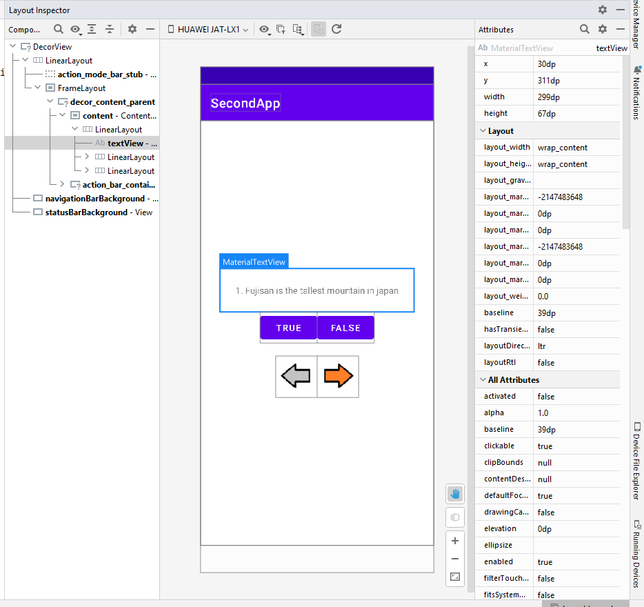
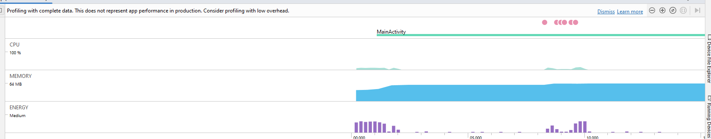
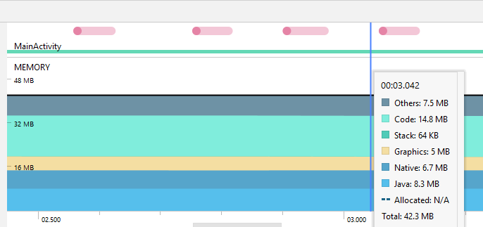
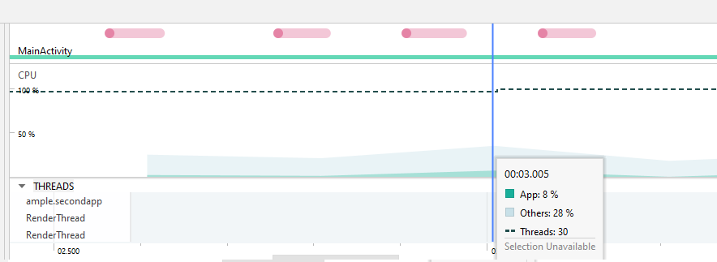

МИНИСТЕРСТВО НАУКИ И ВЫСШЕГО ОБРАЗОВАНИЯ
РОССИЙСКОЙ ФЕДЕРАЦИИ
ФЕДЕРАЛЬНОЕ ГОСУДАРСТВЕННОЕ БЮДЖЕТНОЕ
ОБРАЗОВАТЕЛЬНОЕ УЧРЕЖДЕНИЕ ВЫСШЕГО ОБРАЗОВАНИЯ
«САХАЛИНСКИЙ ГОСУДАРСТВЕННЫЙ УНИВЕРСИТЕТ»

      

Институт естественных наук и техносферной безопасности Кафедра информатики Сунагатов Денис Ринатович

   

Лабораторная работа №4 «Отладка Android-приложений» 01.03.02 Прикладная математика и информатика

            

Научный руководитель 
Соболев Евгений Игоревич

   

г. Южно-Сахалинск 2023 г.

***
# 
Оглавление

- [Цели и задачи](#цели-и-задачи)
- [Решение задач](#решение-задач)
    - [Упражнение. Исследуем Layout Inspector](#layout_inspector)
    - [Упражнение. Profiler](#profiler)
- [Вывод](#вывод)

***

# Цели и задачи

1.  Упражнение. Исследуем Layout Inspector
Для диагностики проблем с файлами макетов и интерактивного анализа визуализации макета на экране можно воспользоваться инструментом Layout Inspector. Убедитесь в том, что GeoQuiz выполняется в эмуляторе, и нажмите кнопку Layout Inspector на левой панели окна Android Monitor. Далее вы сможете исследовать свойства своего макета, щелкая на элементах в представлении Layout Inspector. 
 
2.  Упражнение. Profiler 
С помощью инструмента Profiler создаются подробные отчеты о том, как ваше приложение использует ресурсы Android-устройства, а именно процессор и память. Это полезно при оценке и настройке производительности вашего приложения. Для просмотра окна Profiler запустите приложение на подключенном Android устройстве или эмуляторе, в строке меню выберите команду View ⇒ Tool Windows ⇒ Profiler. В открывшемся окне Profiler отобразится временная шкала с показаниями по использованию сети, процессора, памяти и заряда аккумулятора. Щелкните по разделу, чтобы увидеть более подробную информацию об использовании этого ресурса вашим приложением. В режиме просмотра процессора нажмите кнопку Record, чтобы получить более подробную информацию об использовании процессора. После выполнения любых взаимодействий с приложением, которые вы хотите записать, нажмите кнопку Stop, чтобы остановить запись.

***

# Решение задач

## Упражнение. Исследуем Layout Inspector

Поработав с Layout Inspector, я разобрался, как можно отлаживать UI и находить проблемы с лейаутом активити.

## Упражнение. Profiler 

Работа с Profiler, можно отслеживать и локализировать проблемы с производительностью, памятью и энергопотреблением.

***

## Вывод

Научился использовать Layout Inspector и профайлер для отслеживанием проблем с активити и отслеживать проблемы оптимизации приложения.
